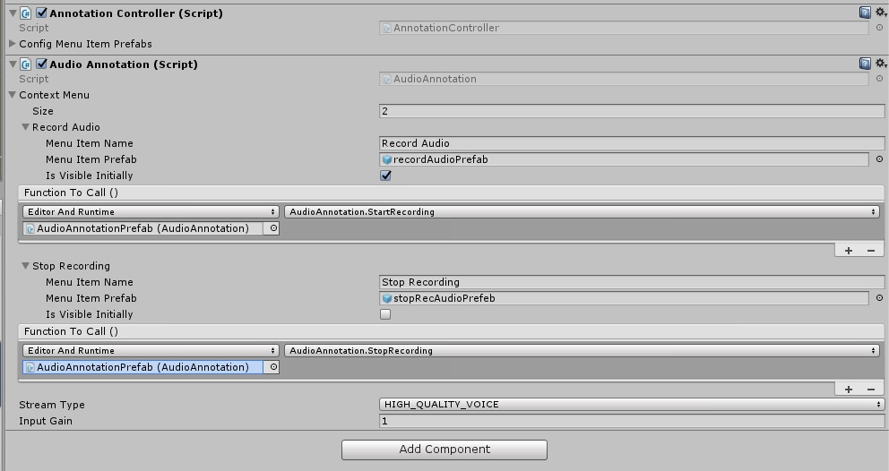

# MirageXR: Annotations

Each annotation has a controller that handles common controls (e.g. 
'remove annotation) and a unique element (script) that handles the 
functions specific to that annotation.

The code functions for each annoatation (e.g. start audio recording, 
replay video recording etc.) are linked to prefabs, which will determine 
what is displayed when the user clicks an instance an annotation.

## Adding or Modifying Annotation Types

The list of available annotations is specified inside the task station 
prefab, which can be found in the 'WEKIT / Recorder / Resources' folder.
Adding new annotation types is done by extending the array in the Unity 
inspector and dragging the new prefab in to the component.  

When creating new annotation types, the 'Annoatation Controller' component 
should be added as a component in Unity.  An annotation-specific script 
is then added and should inherent the 'AnnotationBase' class, allowing 
its context menu to be set in Unity.

Updating prefabs is done by simply dragging the new prefab into the 
component in place of the previous one. The new prefab should be put in 
the 'WEKIT / Recorder / Resources / Annotations' folder and, if updating, 
the obsolete prefab should be moved to another folder or deleted.

# Adding functionality to an annotation

In order for an annotation to be useful, it must have a visual component,
or icon that represents a function (we are not using text menus).  For 
example, the 'start recording' function could be represented by a red cube.
This object must have a collider so it is interactable using air taps.

## Changing the View

Each annotation prefab has an 'icon' child object that 
contains the main mesh renderer component and a 'ring' child object that 
is activated or deactivated depending on whether the prefab represents 
an instance of an annotation or a menu item, respectively.  

Currently, the 'ring' component is searched for by name, so should be 
present in any new prefabs created.

## Linking view to a function in the code

The unique script for each annotation work as a library of functions. 
There is a class called 'AnnotationMenuItem' which contains 4 elements 
and is specified in the script 'Annotation Base', allowing it to be 
inhereted by each of the unique annotations, which are:

* Menu Item Name 		| Human readable name of the menu item.
* Menu Item Prefab 		| The prefab, described above.
* Is Visible Initiall	| A boolean that determines whether a newly created annotation with show this option.
* Function to Call		| This is where the link is made between the prefab and the function.  Described below.

### Adding a new link to a code function

This is done in four steps, all of which can be accomplished in Unity. 

	1. Add a new element to the 'Context Menu' array, in the inspector, which will, in most cases, duplicate the last one already in the list.
	2. Specify when to use this - I generally pick 'Editor and Runtime' to enable testing of the code in Unity before compiling.
	3. Specify the file. This can be any script in the code project, though the convention here is to use the annotation script itself, so drag the component we are editing into this box (see above screenshot).
	4. From the drop-down list of functions, choose the script (same as 3) and the function inside this that you wish to invoke when tapping.

### Notes when writing functions

Rememeber that, if the IsVisibleInitally property is false, the prefab 
must be activated ('gameObject.SetActive(true)') within some other 
function, else it will never be displayed.