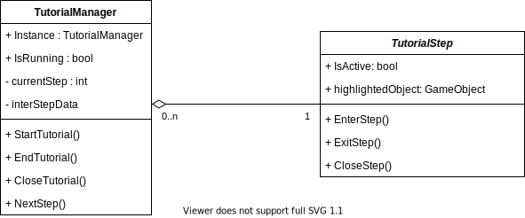
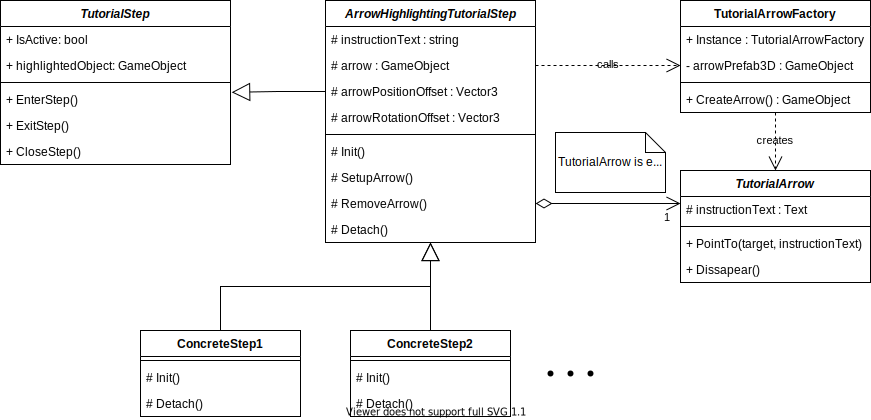
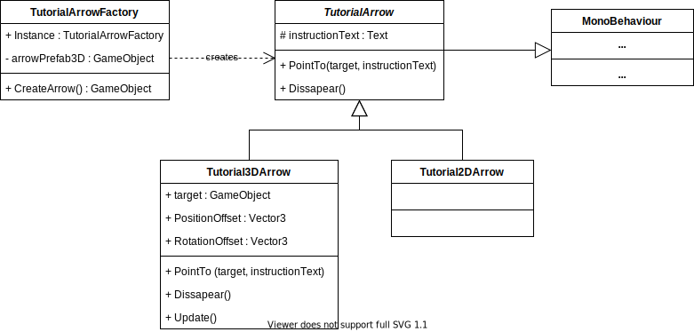
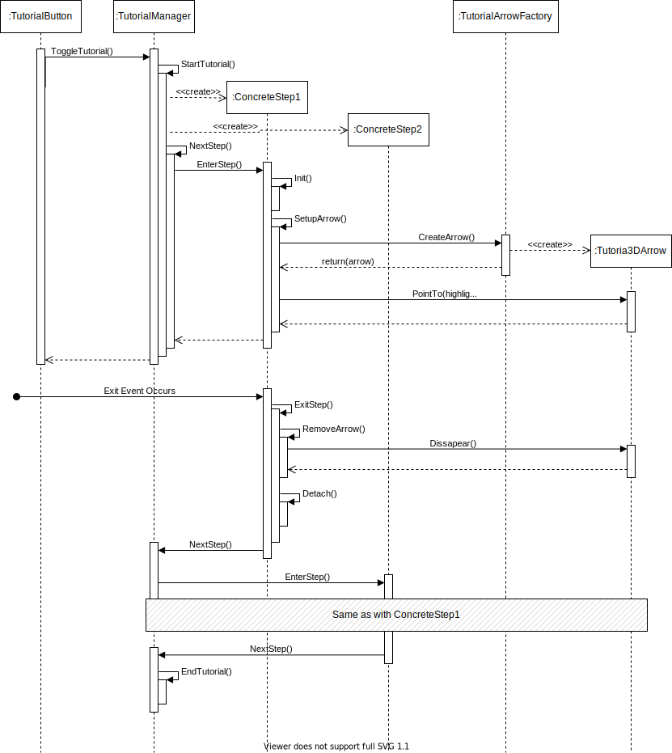

# Tutorial Manager

This is a guide to the structure and intended use of the MirageXR Tutorial Manager.

The purpose of the Tutorial is to provide an insight to a new user into how to work with the MirageXR environment and provide an introduction to its various functionalities. This in itself is another functionality which the Tutorial Manager is responsible for enabling.

## Class Structure and Architecture

In terms of architecture, the main goal was to create a way of showing the user the functions of Mirage in a lightweight manner. First of all a Tutorial Scenario was created, which is a document that defines what steps a user should be taking in the tutorial. A tutorial would then consist of these steps, which would be executed in order, one after the other.

### TutorialManager

Translating this into a class structure means that the Tutorial Manager would be responsible for executing these steps. Therefore the manager creates and stores individual steps, which are defined in separate classes.

The Tutorial Manager is responsible for setting itself up and creating all intended Steps (*StartTutorial()*), as well executing them in order (*NextStep()*). *EndTutorial()* and *CloseTutorial()* are to be used when the Tutorial has finished all steps or was stopped in the middle of a step, respectively.

### TutorialStep

*TutorialStep* is an abstract class, which is inherited by all concrete Steps. A tutorial Step must be able to set itself up, whatever that may include (*EnterStep()*) and then also undo its actions in order to set the scene for the next step (*ExitStep()*) or remove itself from the scene in case there is an error or the user has exited the tutorial (*CloseStep()*). The *highlightedObject* is the object in focus on the screen, the object which the Tutorial is now explaining.

Going into more detail, the TutorialStep was envisioned to be a basis for all steps but for this first instance of the Tutorial, mainly one existing prefab was used (*Tutorial3DArrow.prefab*). For this reason the *ArrowHighlightingTutorialStep* is used as a template for all steps that use this prefab. It includes:
- *instructionText* - The text that will be shown to the user, relevant to the Step.
- *arrow* - The GameObject of the instantiated prefab.
- *arrowPositionOffset* and *arrowRotationOffset* - Offsets for the arrow, used to reposition the arrow relevant to it's starting position (the position of *highlightedObject* in TutorialStep).

The *ArrowHiglightingTutorialStep* also overrides the methods of *TutorialStep* to include the following methods:
- Init() - Sets up all relevant listeners for the step, to know when the step should finish. Also defines the *highlightedObject*. Called in *EnterStep()*.
- SetupArrow() - Calls the *TutorialArrowFactory* to produce a *TutorialArrow* which is then saved as a component of the *arrow* object. Called in *EnterStep()*.
- RemoveArrow() - Removes the *arrow* object from the scene and destroys it. Called in *ExitStep()* and *CloseStep()*.
- Detach() - Undoes *Init()*. Called in *ExitStep()* and *CloseStep()*.

While *SetupArrow()* and *RemoveArrow()* are largely the same for most *ConcreteSteps*, *Init()* and *Detach()* have to be defined in each of them, as they all listen to different events and have different highlighted objects.

### Tutorial Arrow

In the start it was intended that the *TutorialArrowFactory* would create arrows for both 2D (Mobile UI) and 3D (Hololens) environments. Once *CreateArrow()* is called by a Step, the factory is responsible for assessing which arrow is needed based on the environment and creating a child of *TutorialArrow* to match it. So far, only the 3DArrow has been implemented.

*TutorialArrow* itself is an abstract class which inherits from MonoBehaviour, in order for it to be able to handle the instantiated prefab object. Its field, *instructionText* is the text that will be shown to the user. *PointTo(target, instructionText)* directs the arrow object to the *target*, showing the *instructionText*. *Dissapear()* makes the arrow dissables the arrow's gameobject.

*Tutorial3DArrow* is a concrete implementation of the *TutorialArrow* class. It is meant to be used in 3D environments such as that of Hololens. Of note in this class is the use of Unity's *Update()* method from *MonoBehaviour*. It's used in order to make the position and rotation of the arrow relevant to it's target fixed, so that if the target is moved, the arrow moves with it.

## Behaviour

Below is a Sequence Diagram showing how the *TutorialManager* works with two steps.

The *TutorialManager* is started when the user clicks the *TutorialButton*. The manager first creates all predetermined steps, in this case steps 1 and 2. Once it is done creating steps it starts its first *NextStep*() call, which starts the first step by calling its *EnterStep*(). *EnterStep* first calls the step's *Init*() method, which connects its listeners to perceived exit events. Then, *SetupArrow*() starts, calling the *TutorialArrowFactory*'s *CreateArrow*() method, which creates a *Tutorial3DArrow* instance, placing it in an instantiated GameObject based on the prefab. The arrow is then set to point to the highlightedObject, with the instructionText. This segment then ends, while waiting for the step's exit event (set up in *Init*()) to occur.

When the exit event occurs, the step calls its *ExitStep*(), which removes the arrow from the scene in *RemoveArrow*() and detaches the step from events in *Detach*(). Finaly, *NextStep*() is called on the *TutorialManager*.

The following segment is the same as with *ConcreteStep1*, everything between *EnterStep*() and *NextStep*(). Of course, there is a difference in what object is highlighted and what text is shown. Once *NextStep*() is called on the *TutorialManager*, because there are no more steps, it ends the tutorial.
